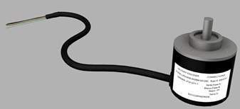

<h1 style="text-align:center;">PROYECTOS</h1>

# Teclado matricial 4x4

Diseño 3D del teclado matricial 4 x 4 utilizado para proyectos que requieran placas de desarrollo o microcontroladores.
Donde se necesita colocar algún código numérico.

Aplicaciones:
- Creación de cajas de seguridad
- Controles de acceso o en general activación por algún botón del teclado

**Diseño 3D [GRABCAD](https://grabcad.com/library/teclado-matricial-4x4-1)**

Diseñado por Jesús Ramirez 

# Display LCD 2x16

Diseño 3D utilizado para un proyecto que los muestra datos numericos de la humedad y temperatura usando Arduino UNO.  

Es muy útil cuando hay que mostrar información de algún proyecto, pueden ser mensajes, datos numéricos o caracteres especiales.
El proceso de visualización en la pantalla es regido por el controlador LCD HD44780. 

Datos Tecnicos:

- Pantalla es retro iluminada en color azul
- Dimensiones son 6.5 cm x 1.6 cm
- Tarjeta que la soporta son 8 cm x 3.6 cm x 1.2 cm
- Display LCD 2x16 (2 filas x 16 caracteres)

**Diseño 3D [GRABCAD](https://grabcad.com/library/display-lcd-2x16-2)**

Diseñado por Jesús Ramirez 

# Servomotor con torque de 10 kgf/cm

Este servomotor es ideal para proyectos de robótica en los que necesitas gran fuerza de torque. Sus características de funcionamiento lo hacen excelente para utilizarlo con tarjetas de programación Arduino* o microcontroladores.

**Diseño 3D [GRABCAD](https://grabcad.com/library/servomotor-con-torque-de-10-kgf-cm-1)**

Diseñado por Jesús Ramirez 

# Convertidor AC DC HLK-5M05

El Convertidor AC DC Fuente 5W es un dispositivo electrónico comúnmente llamado fuente de alimentación, fuente de poder o fuente conmutada. En electrónica se define como el instrumento que transforma corriente alterna en corriente continua en una o varias salidas.

**Diseño 3D [GRABCAD](https://grabcad.com/library/convertidor-ac-dc-hlk-5m05-1)**

Diseñado por Jesús Ramirez 

# Rotary Encoder

Un encoder es un dispositivo de detección que proporciona una respuesta. Los Encoders convierten el movimiento en una señal eléctrica que puede ser leída por algún tipo de dispositivo de control en un sistema de control de movimiento, tal como un mostrador o PLC.

**Diseño 3D [GRABCAD](https://grabcad.com/library/rotary-encoder-28)**

Diseñado por Jesús Ramirez 

# Modulo Carga Tipo C Bateria De Litio Tp4056 18650

El TP4056 se utiliza comúnmente en dispositivos portátiles y dispositivos de alimentación móvil, como cargadores de teléfonos móviles y dispositivos de alimentación portátil.

**Diseño 3D [GRABCAD](https://grabcad.com/library/modulo-carga-tipo-c-bateria-de-litio-tp4056-18650-1)**

Diseñado por Jesús Ramirez y en colaboración con CDMX Electronica.

# Doble Puente H TB6612FNG

Es una pequeña placa integrada por un circuito integrado TB6612FNG que los permite tener la manipulación de motores de CD. La placa viene con todos los componentes instalados como se muestra. Los condensadores de desacoplamiento se incluyen en ambas líneas de suministro. Los pines están dispuestos de modo que los pines de entrada están en un lado y los pines de salida están en el otro

**Diseño 3D [GRABCAD](https://grabcad.com/library/doble-puente-1)**

Diseñado por Jesús Ramirez y en colaboración con CDMX Electronica.

# Doble Puente H Mx1508

El Doble Puente H un modulo que esta construido por un circuito integrado MX1508* ideal para controlar independientemente el sentido de giro de cada uno de los dos motores que maneja, generando mínima cantidad de calor con menor caída de voltaje a la salida de los motores. Con un consumo de 1.5A y un máximo de 2.0A.

**Diseño 3D [GRABCAD](https://grabcad.com/library/doble-puente-h-mx1508-2)**

Diseñado por Jesús Ramirez y en colaboración con CDMX Electronica.

# Monster Shield Arduino

Esta es básicamente una versión mejorada de nuestro shield de controlador de motor Ardumoto. Para este shield SparkFun Monster Moto, reemplazamos el puente H L298 con un par de controladores de motor de puente completo VNH2SP30. También reforzamos los circuitos de soporte para que esta placa sea capaz de controlar un par de motores de alta corriente. El VIN y la salida del motor están diseñados para nuestros terminales de tornillo de 5 mm (no incluidos), lo que facilita la conexión de cables de mayor calibre.

**Diseño 3D [GRABCAD](https://grabcad.com/library/monster-shield-arduino-1)**

# Motor Drive Shield L293d Expansion Para Arduino Uno

El L293D Shield Controlador de Motor es un módulo diseñado para controlar hasta cuatro motores de corriente directa, dos servomotores, cuatro solenoides, cuatro relevadores y dos motores a pasos unipolares o bipolares. Se monta sobre una placa Arduino Uno o Mega. Permite manipular la velocidad y el sentido de giro de los motores conectados, facilitando el control y desarrollo de proyectos de robótica y automatización.

**Diseño 3D [GRABCAD](https://grabcad.com/library/motor-drive-shield-l293d-expansion-para-arduino-uno-1)**

